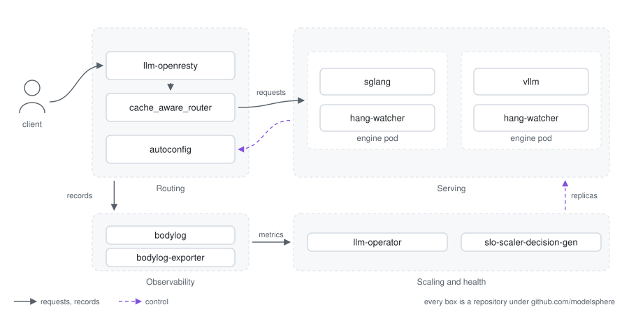

# ModelSphere

<p align="center">
  <a href="./LICENSE"></a>
  <a href="https://github.com/modelsphere"></a>
  <a href="docs/install.md"></a>
</p>

An LLM inference stack for Kubernetes, and the deployment repository that
installs it: node preparation (Ansible), a cluster (kubeadm), and one helmfile
for everything that runs inside it -- the routing layer, the autoscaler, the GPU
and RDMA operators, monitoring, and the inference engines.

- **Routing that keeps the cache warm.** A conversation goes back to the replica
  that already holds its context; a new one goes to the replica holding the
  longest matching prefix. An LLM replica that has the context answers far more
  cheaply than one rebuilding it, so this is not load balancing.
- **Admission control that follows the backends.** A concurrency limit per
  backend pool, shared across the router's workers and answered with 429 rather
  than a queue nobody can see -- and, with adaptive concurrency on, a limit that
  moves by AIMD against measured TTFT and decode rate instead of a number
  somebody guessed.
- **Autoscaling on LLM signals.** KV-cache pressure and queue depth rather than
  CPU, and SLO targets that turn into replica counts.
- **Engines that stay up.** A sidecar restarts an engine that stopped making
  progress but still answers `/health`; shutdown drains in-flight requests
  before releasing the GPUs; one instance can span several nodes.

## Architecture

<p align="center">
  
</p>

## Components

All open source under
[github.com/modelsphere](https://github.com/modelsphere). Routing is the part
worth understanding first: an LLM replica that already holds a conversation's
context answers it far more cheaply than one that has to rebuild it, so this is
not load balancing.

| Component | What it does | Repository |
|---|---|---|
| **Routing** | | |
| llm-openresty | Session-affinity router: pins a conversation to the backend that already holds its context | [llm-openresty](https://github.com/modelsphere/llm-openresty) |
| cache_aware_router (CART) | Routes each request to the replica holding the longest matching prefix | [cache_aware_router](https://github.com/modelsphere/cache_aware_router) |
| autoconfig | Operator that keeps the routing layer's config in step with the backends that exist | [autoconfig](https://github.com/modelsphere/autoconfig) |
| **Scaling and health** | | |
| llm-operator | Autoscales inference workloads on LLM-specific signals (KV-cache pressure, queue depth) | [llm-operator](https://github.com/modelsphere/llm-operator) |
| slo-scaler-decision-gen | Turns SLO targets and live signals into replica decisions | [slo-scaler-decision-gen](https://github.com/modelsphere/slo-scaler-decision-gen) |
| hang-watcher | Sidecar that restarts an engine which stopped making progress but still answers `/health` | [hang-watcher](https://github.com/modelsphere/hang-watcher) |
| **Observability** | | |
| bodylog, bodylog-exporter | Full request/response records from the router, and Prometheus metrics from them | [llm-openresty](https://github.com/modelsphere/llm-openresty) |
| **Engines** | | |
| sglang, vllm charts | The engine binaries are upstream; the charts are what makes them serve: shutdown that drains in-flight requests and then gets the GPUs released, hang-watcher wired to the liveness probe, the model's own CART, one instance spanning several nodes (LeaderWorkerSet), and the routing and scaling CRs that put the model on the router | [helm-charts](https://github.com/modelsphere/helm-charts) |

## Quick start

Prerequisites:

1. a Kubernetes cluster, and `kubectl` pointing at it;
2. `helm`, `helmfile` and the `helm-diff` plugin.

```bash
# 1. the stack itself, one pass
cp environments/private.yaml.example environments/mycluster.yaml   # edit it,
#    then add it under `environments:` in helmfile.yaml.gotmpl -- a values file
#    nothing registers is a file helmfile never reads:
#      mycluster:
#        values:
#          - environments/default.yaml
#          - environments/mycluster.yaml
make helm-apply ENV=mycluster

# 2. a model
helm repo add modelsphere https://modelsphere.github.io/helm-charts
helm upgrade --install qwen modelsphere/sglang -n llm-demo --create-namespace \
  -f <your values.yaml>       # models/examples/sglang-qwen.yaml is a worked example
```

That first command installs **thirteen releases**, not just ours: alongside the
routing layer, the autoscaler and the request log, it brings the NVIDIA GPU and
network operators, kube-prometheus-stack, LeaderWorkerSet, Volcano, the
descheduler and node-problem-detector. A cluster that already has any of them
turns it off by name -- every release is a key under `enabled:` in
[`environments/default.yaml`](environments/default.yaml), which is also the list
of what you get. `helmfile -e <env> list` prints the same thing for your
environment before you apply it.

The model is served through the routing layer, at
`http://openresty.llm-route.svc:8080/<release>/v1/chat/completions` -- the
release name from step 2 is the path prefix (`qwen` above), and it is how the
router picks the model.

```bash
kubectl -n llm-route port-forward svc/openresty 8080:8080 &
curl http://127.0.0.1:8080/qwen/v1/chat/completions \
  -H 'Content-Type: application/json' \
  -d '{"model":"Qwen/Qwen2.5-0.5B-Instruct",
       "messages":[{"role":"user","content":"hello"}],"max_tokens":32}'
```

Exposing that outside the cluster is a Gateway, an Ingress or a Service of your
choosing -- [the walkthrough](docs/install.md#7-gateway-objects) ships Gateway
API objects for it.

## Documentation

| Document | What is in it |
|---|---|
| [`docs/install.md`](docs/install.md) | the complete install: preparing the machines, creating the Kubernetes cluster, and installing the stack on it -- with the air-gapped path and the detail on each step linked from there |

## Contributing

Please read the [Contributing Guide](CONTRIBUTING.md) — where a change belongs
(most of ModelSphere lives in the component repositories, not here), and what to
run before opening a pull request.

## License

Apache 2.0 -- see [LICENSE](./LICENSE).
